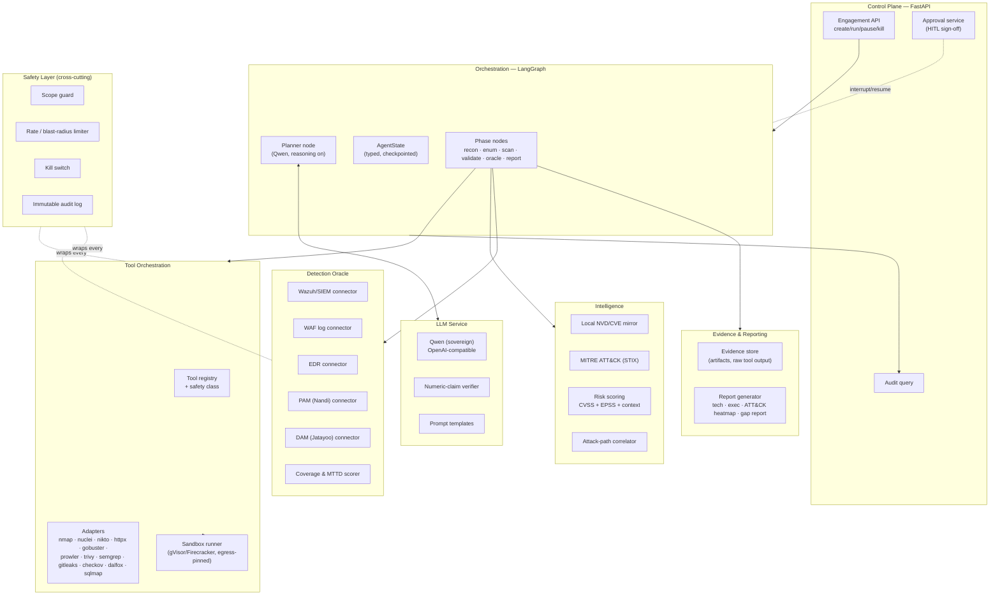
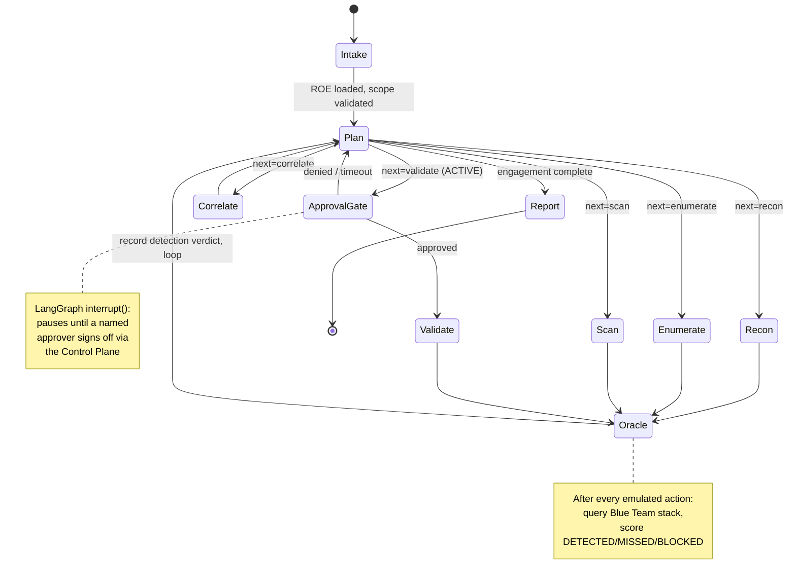
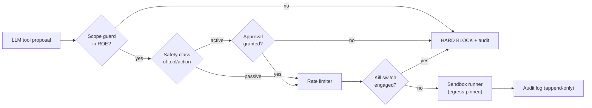

# RedBlueAI Safeguard — Architecture

This document describes the internal architecture of the Safeguard (Red Team) agent: its components, the LangGraph state machine that drives it, the data model, and the safety architecture that wraps every action.

---

## 1. Design principles

These are non-negotiable and shape every component below.

1. **Control validation over vulnerability discovery.** The primary output is *"did the Blue Team stack catch this?"*, not just *"this is vulnerable."* The Detection Oracle is a first-class component, not an afterthought.
2. **Non-destructive by default.** The agent proves the *signal* of a weakness, never its destructive payoff. Shipped profiles cannot exfiltrate, mutate, deny service, or persist.
3. **Fail-closed safety.** Scope, rate, and approval checks default to *deny*. Any ambiguity halts the action.
4. **The LLM proposes; deterministic code disposes.** The model plans and reasons; it can never directly execute a tool. Every tool call passes through the policy layer, is bound to the ROE, and (for active steps) waits for human approval.
5. **Ground every number.** CVE IDs, CVSS, EPSS, port numbers, counts — all come from tool/DB output and pass a numeric-claim verifier before entering a report. The LLM narrates; it does not invent figures.
6. **Sovereign & offline-capable.** No foreign API in the default build. CVE data is a local NVD mirror; ATT&CK is a local STIX bundle; inference is on ESDS sovereign cloud.
7. **Everything is auditable and resumable.** State is checkpointed; the audit log is append-only and hash-chained.

---

## 2. System context

```mermaid
flowchart TB
    subgraph RB["RedBlueAI Platform"]
        SG["SAFEGUARD loop\n(this system)"]
        DET["DETECT loop\ncorrelation / incidents"]
        ACT["ACT loop\nautomated response"]
    end

    OP["Security Engineer / Approver"] -->|scope, approvals| SG
    SG -->|emulated attacker activity\n(non-destructive, in-scope)| EST["Authorised ESDS Estate\n(web, cloud, k8s, source)"]
    EST -->|telemetry| DEF["Blue Team Stack\nWazuh SIEM · WAF · EDR · Nandi PAM · Jatayoo DAM"]
    SG <-->|query: was it detected?| DEF
    SG -->|detection-gap report,\nvalidated findings| DET
    DET --> ACT
    SG -->|technique → expected-detection\nfeedback| DET
```

Safeguard is the only component that intentionally generates attacker behaviour. It reads the same defensive telemetry the Detect loop consumes, but for a different purpose: to compare *what it did* against *what the defenders saw*.

---

## 3. Component architecture



### 3.1 Control Plane (FastAPI)
The operator-facing surface and the only way to start, pause, approve, or kill an engagement. Responsibilities: engagement lifecycle, the approval queue that satisfies LangGraph interrupts, audit query, and the kill switch. Stateless except for the engagement/approval tables; all long-running state lives in the checkpointer.

### 3.2 Orchestration (LangGraph)
A `StateGraph` over a typed `AgentState`. The **Planner node** is the brain: given current state, ROE, and findings so far, it selects the next tactic and the tool(s) to run, expressed as a structured tool-call proposal. Phase nodes execute the concrete work. Conditional edges route based on findings and phase completion. A checkpointer (Postgres/SQLite) persists state after every node, giving resumability and a replayable trace. `interrupt()` is used before every active step to pause for human approval.

Why LangGraph specifically: explicit state, deterministic edges, first-class `interrupt`/resume for HITL, and checkpointing map exactly onto the "LLM proposes, code disposes, human approves, everything auditable" requirement — far cleaner than an open-ended ReAct loop for a system that must be safe and replayable.

### 3.3 Tool Orchestration
- **Registry (`tools.yaml`)** — every tool declared with its **safety class** (see §6), default flags, output parser, and the sandbox image it runs in.
- **Adapter framework** — each tool implements a common `ToolAdapter` interface: `build_command(params) → validate() → run() → parse() → ToolResult`. Parsing normalises heterogeneous tool output (Nmap XML, Nuclei JSONL, Trivy JSON, …) into one `Finding` schema.
- **Sandbox runner** — tools execute in ephemeral, egress-pinned containers (gVisor or Firecracker) that can only reach in-scope targets. The agent process never runs tools on its own host.

### 3.4 Intelligence
- **Local NVD/CVE mirror** — CVE lookups hit an internal mirror (kept fresh via periodic sync), preserving sovereignty and offline operation.
- **MITRE ATT&CK (STIX)** — a local ATT&CK bundle maps each finding/action to tactics and techniques (e.g. `T1190 Exploit Public-Facing Application`, `T1046 Network Service Discovery`).
- **Risk scoring** — combines CVSS base, EPSS exploit-likelihood, and *contextual* factors (asset criticality, exposure, and crucially **whether the Oracle showed it was undetected**). An undetected medium can outrank a detected high.
- **Attack-path correlator** — chains findings into candidate kill-chains (e.g. exposed service → CVE → lateral path), each annotated with ATT&CK techniques and the detection status at each hop.

### 3.5 Detection Oracle *(the differentiator)*
After each emulated action, the Oracle asks the defensive stack whether it noticed. Each connector is **read-only** and queried for the action's time window and target:

| Connector | Question it answers |
|-----------|--------------------|
| Wazuh/SIEM | Did a rule fire? Which one? At what severity? How long after the action? |
| WAF (ModSecurity/Coraza) | Was the request blocked / logged? Which rule (CRS ID)? |
| EDR | Was the process/behaviour flagged or contained on the host? |
| PAM (Nandi) | Was the privileged access request logged / challenged? |
| DAM (Jatayoo) | Was the DB access recorded / anomaly-flagged? |

The **coverage & MTTD scorer** turns raw connector responses into per-action verdicts — `DETECTED` / `PARTIAL` / `MISSED` / `BLOCKED` — plus **time-to-detect**. Aggregated, this becomes the detection-coverage matrix and the gap report handed to Detect/Act. This closes the purple-team loop.

### 3.6 LLM Service
An OpenAI-compatible client to the sovereign Qwen endpoint. Used for: planning/tool-selection (reasoning mode on), finding triage/dedup, ATT&CK mapping assistance, attack-path hypothesis, and narrative report sections. The **numeric-claim verifier** intercepts LLM output and rejects/regrounds any figure (CVE, CVSS, count, port) not backed by a tool/DB artifact — a zero-tolerance gate against hallucinated numbers.

### 3.7 Evidence & Reporting
- **Evidence store** — raw tool output, request/response captures, screenshots, and Oracle query results, content-addressed and linked to findings.
- **Report generator** — produces a technical report (findings + evidence + severity), an executive summary, an **ATT&CK coverage heatmap** (technique × detected/missed), and the **detection-gap report** for Detect/Act.

### 3.8 Safety Layer (cross-cutting)
Not a node — a set of interceptors every tool and Oracle call passes through: scope guard, rate/blast-radius limiter, kill switch, and the immutable audit log. Detailed in §6 and in `SAFETY.md`.

---

## 4. The LangGraph state machine



**Loop logic.** The Planner is re-entered after every action. It looks at accumulated findings, remaining scope, budget, and the ROE, then chooses the next step or decides the engagement is done. Passive nodes (recon, enumerate, scan) flow straight into the Oracle. Any *active* node (validate, technique execution) is preceded by an **ApprovalGate** that calls `interrupt()`; the graph parks until the Control Plane injects an approval decision, then resumes exactly where it left off (thanks to the checkpointer).

### 4.1 `AgentState` (conceptual schema)

```python
class AgentState(TypedDict):
    engagement_id: str
    roe: RulesOfEngagement          # scope, windows, approvers, excluded actions
    mode: Literal["black_box", "gray_box", "white_box"]
    profile: str                    # "non_destructive" (only default-enabled profile)

    phase: str                      # current phase
    budget: EngagementBudget        # request/time/action ceilings + spend

    assets: list[Asset]             # discovered hosts, services, endpoints, tech
    findings: list[Finding]         # normalised, deduplicated
    validations: list[Validation]   # safe PoC outcomes (gated)
    detections: list[DetectionResult]   # Oracle verdicts per action
    attack_paths: list[AttackPath]

    pending_approval: Optional[ApprovalRequest]
    audit_ref: str                  # hash-chain head
    artifacts: list[ArtifactRef]    # evidence pointers
```

`findings`, `detections`, etc. use reducer-based merges so parallel node runs append safely rather than overwrite.

---

## 5. Data model (core entities)

| Entity | Key fields |
|--------|-----------|
| `Asset` | id, type (host/service/endpoint/repo/cloud-acct), address, tech fingerprint, in_scope |
| `Finding` | id, asset_ref, source_tool, title, cve_ids[], cvss, epss, severity, attack_techniques[], evidence_refs[], status |
| `Validation` | finding_ref, method, non_destructive: true, approved_by, result (confirmed/inconclusive), evidence_ref |
| `DetectionResult` | action_ref, target, technique, verdict (DETECTED/PARTIAL/MISSED/BLOCKED), source (wazuh/waf/edr/pam/dam), rule_id, ttd_seconds |
| `AttackPath` | steps[] (asset → technique → detection verdict), overall_risk, narrative |
| `AuditEvent` | ts, actor (agent/human), action, params_hash, prev_hash, hash |

The `DetectionResult` table *is* the product. A finding with `verdict=MISSED` is worth more to Detect/Act than ten detected criticals.

---

## 6. Safety architecture (summary — see `SAFETY.md` for full)

Every tool invocation is a pipeline of interceptors:



**Tool safety classes** (declared in `tools.yaml`):

| Class | Meaning | Examples | Gate |
|-------|---------|----------|------|
| `passive` | observe only, no packets to target beyond standard requests | whois, local NVD lookup, Semgrep/Gitleaks on provided source | rate limit only |
| `active-recon` | active but benign probes | Nmap, httpx, WhatWeb, Gobuster, Nuclei (safe templates), Prowler, Trivy | rate limit |
| `active-validate` | confirms a signal, non-destructive | Dalfox (reflection), SQLMap (`--technique` detection, no dump), curated ATT&CK techniques | **approval + rate limit** |
| `destructive` | data-modifying / DoS / persistence | — | **disabled; cannot be enabled from LLM output** |

The LLM can only ever propose actions in classes it is permitted; the class is a property of the tool binding in code, not something the model can assert or override.

---

## 7. Deployment (sovereign)

- **Inference**: Qwen served on ESDS sovereign GPU (the OpenAI-compatible endpoint). Planner uses reasoning mode; extraction nodes use a cheaper profile.
- **Sandbox**: gVisor/Firecracker microVMs for tool runners; egress firewall pinned to the ROE allowlist so a tool physically cannot reach an out-of-scope host.
- **Data residency**: NVD mirror, ATT&CK bundle, evidence store, and audit log all India-resident on ESDS cloud.
- **Isolation**: Safeguard runs in its own project/tenant, separate from production workloads it tests. Oracle connectors use dedicated read-only service accounts.

---

## 8. How this differs from Strix / generic AI pentest agents

| | Strix (and similar) | RedBlueAI Safeguard |
|--|--------------------|----------------------|
| Primary goal | find & exploit vulnerabilities | **validate whether defenders detect the activity** |
| Payoff artifact | working PoC exploit | **detection-coverage + gap report** |
| Destructive actions | real exploit validation | **non-destructive only, disabled destructive class** |
| Loop | find → exploit → report | find → *safely emulate* → **ask the Blue Team stack** → gap report |
| Deployment | any LLM provider incl. cloud | **sovereign, India-resident, no foreign API** |
| Autonomy | high, agent-driven | **HITL-gated on every active step** |

Strix answers *"can this be hacked?"* Safeguard answers *"if someone hacks it this way, will we know?"* — which is the question an MSSP's platform actually needs to answer for its customers.
