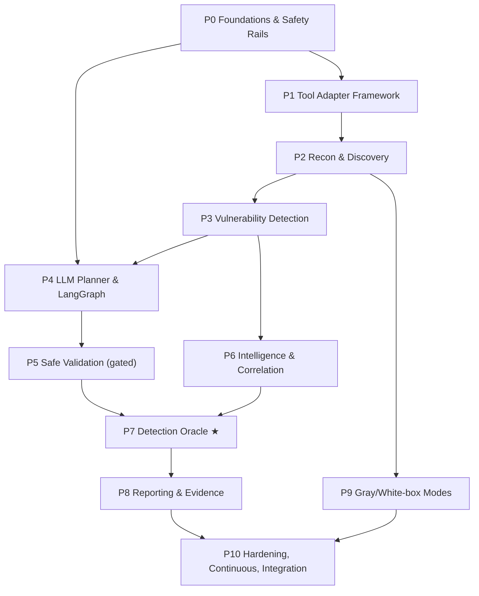

# RedBlueAI Safeguard — Phase-Wise Task Distribution

The build plan. Safeguard is delivered in **11 phases**, sequenced so that **safety rails exist before any offensive capability**, and so that a demonstrable slice (recon → scan → oracle → report) is working early. Each phase lists objective, tasks, deliverables, exit criteria, and dependencies.

Sequencing rule: **no offensive tool ships before the safety layer that governs it.** Phase 0 and Phase 1 are prerequisites for everything.

---

## Phase overview

★ Phase 7 (Detection Oracle) is the differentiating capability; everything before it is table stakes.

---

## Phase 0 — Foundations & Safety Rails
**Objective:** stand up the skeleton and *all* safety primitives before any tool can run. Fail-closed from day one.

**Tasks**
- Repo scaffold, packaging, config loader (`roe.yaml`, `tools.yaml`, `settings.yaml`).
- **Scope guard**: parse ROE (CIDRs, domains, cloud accounts, exclusions, windows); target-resolution + allowlist check; fail-closed.
- **Rules-of-Engagement engine**: schema + validation; time-window enforcement; named-approver registry.
- **Immutable audit log**: append-only, hash-chained events.
- **Kill switch**: control-plane halt that revokes sandbox tokens and cancels in-flight work.
- **LLM client wrapper**: OpenAI-compatible client to the sovereign Qwen endpoint; env-driven config; per-node inference profiles (reasoning on/off); ret/timeout handling.
- **Numeric-claim verifier** (skeleton): interface + regrounding hook.

**Deliverables:** running control-plane stub, `roe.example.yaml`, audit + kill-switch + scope-guard modules with tests.
**Exit criteria:** an out-of-scope target is hard-blocked and audited; kill switch halts a dummy task; no tool code exists yet.
**Depends on:** —

---

## Phase 1 — Tool Adapter Framework
**Objective:** a uniform, sandboxed way to run any external tool and normalise its output.

**Tasks**
- `ToolAdapter` interface: `build_command → validate → run → parse → ToolResult`.
- Unified `Finding` / `ToolResult` schema (normalises Nmap XML, Nuclei JSONL, Trivy JSON, …).
- **Sandbox runner**: ephemeral, egress-pinned containers (gVisor/Firecracker); egress firewall bound to ROE.
- Tool registry with **safety classes** (`passive` / `active-recon` / `active-validate` / `destructive`-disabled).
- Wire adapters through the Phase-0 safety pipeline (scope → class → rate → kill → run → audit).

**Deliverables:** adapter base classes, sandbox images build (`make sandbox-build`), one reference adapter (Nmap) end-to-end through the safety pipeline.
**Exit criteria:** Nmap runs only against in-scope targets, in a sandbox that cannot reach out-of-scope hosts, fully audited.
**Depends on:** P0.

---

## Phase 2 — Recon & Asset Discovery
**Objective:** black-box attack-surface mapping.

**Tasks**
- Adapters: `Nmap`, `httpx`, `WhatWeb`, subdomain enumeration, `Gobuster` (content discovery).
- `Asset` model + dedup/merge; technology fingerprinting.
- Recon sub-flow (sequential/parallel with rate limits).

**Deliverables:** recon phase producing a normalised asset inventory for a demo target.
**Exit criteria:** `safeguard run --phase recon` yields a deduplicated asset list with fingerprints, within budget.
**Depends on:** P1.

---

## Phase 3 — Vulnerability Detection
**Objective:** turn assets into findings (non-destructive detection).

**Tasks**
- Adapters: `Nuclei` (curated safe template sets), `Nikto`.
- Finding normalisation, severity from tool output, dedup across tools.
- Template/policy management (which Nuclei templates are allowed; exclude intrusive/DoS templates).

**Deliverables:** scan phase producing normalised findings with evidence refs.
**Exit criteria:** end-to-end **recon → scan → findings** on the demo app; intrusive templates provably excluded.
**Depends on:** P2.

---

## Phase 4 — LLM Planner & LangGraph Orchestration
**Objective:** the agent brain — decide *what next*, safely.

**Tasks**
- `AgentState` typed schema + reducers.
- `StateGraph` assembly: nodes (recon/enum/scan/correlate/report), conditional edges, planner routing.
- **Planner node** (Qwen, reasoning on): structured tool-call proposals grounded in state + ROE.
- **HITL interrupts**: `interrupt()` before active steps; approval-request/response via control plane.
- Checkpointer (Postgres/SQLite) for resumability + replay.

**Deliverables:** graph that autonomously sequences the passive phases and pauses at active steps.
**Exit criteria:** a full passive engagement runs planner-driven; an active step correctly parks for approval and resumes after sign-off; run is replayable from checkpoints.
**Depends on:** P0, P3.

---

## Phase 5 — Safe Validation Layer *(gated, active)*
**Objective:** confirm findings' *signal* without any destructive effect.

**Tasks**
- Adapters (active-validate class): `Dalfox` (reflected-XSS confirmation), `SQLMap` in **detection-only** mode (boolean/time technique, `--level` low, **no dump/OS-shell**).
- Curated, non-destructive ATT&CK technique executors for testing specific detections.
- Enforce non-destructive profile in code (deny data-mod/exfil/DoS/persistence regardless of LLM output).
- Approval-gate integration + evidence capture for every validation.

**Deliverables:** validation phase that only runs post-approval and only in non-destructive mode.
**Exit criteria:** a validation attempt without approval is blocked; approved validation confirms a signal and captures evidence; no destructive action is reachable.
**Depends on:** P4.

---

## Phase 6 — Intelligence & Correlation
**Objective:** enrich, map, and chain findings — grounded, sovereign.

**Tasks**
- **Local NVD/CVE mirror** + sync job; CVE enrichment.
- **MITRE ATT&CK STIX** bundle + technique mapping.
- Risk scoring (CVSS + EPSS + asset criticality + detection status).
- Attack-path correlator (kill-chain candidates, ATT&CK-annotated).
- Activate numeric-claim verifier on all enriched figures.

**Deliverables:** enriched findings with CVE/ATT&CK/risk; candidate attack paths.
**Exit criteria:** every numeric claim in output traces to a tool/DB artifact; no external CVE call in default build.
**Depends on:** P3.

---

## Phase 7 — Detection Oracle *(the differentiator)*
**Objective:** answer "did the Blue Team stack catch it?" for every emulated action.

**Tasks**
- Read-only connectors: **Wazuh/SIEM**, **WAF** (ModSecurity/Coraza logs), **EDR**, **PAM (Nandi)**, **DAM (Jatayoo)**.
- Action↔detection correlation by time window + target + technique.
- Coverage & MTTD scorer: `DETECTED / PARTIAL / MISSED / BLOCKED` verdicts.
- `DetectionResult` model + wiring so the Oracle runs after every action node.

**Deliverables:** detection verdicts + MTTD attached to each action; coverage matrix.
**Exit criteria:** on the demo run, each emulated action gets a correct verdict validated against the actual SIEM/WAF state.
**Depends on:** P5, P6.

---

## Phase 8 — Reporting & Evidence
**Objective:** the deliverables humans and downstream loops consume.

**Tasks**
- Evidence store (content-addressed artifacts linked to findings).
- Technical report + executive summary (LLM-narrated, verifier-gated).
- **ATT&CK coverage heatmap** (technique × detected/missed).
- **Detection-gap report** (every MISSED/PARTIAL + expected detection) — the Detect/Act handoff artifact.

**Deliverables:** full report bundle per engagement in `runs/<id>/`.
**Exit criteria:** a stakeholder can read posture, coverage %, and the exact gaps with expected detections; every figure is grounded.
**Depends on:** P7.

---

## Phase 9 — Gray-box & White-box Modes
**Objective:** deeper assessment postures.

**Tasks**
- Gray-box: cloud posture (`Prowler`, `Trivy`) with read-only IAM; k8s read-only checks.
- White-box: `Semgrep` (SAST), `Gitleaks` (secrets), `Trivy` (deps/containers), `Checkov` (IaC) over provided source/manifests.
- Mode-aware planner behaviour and scope handling.

**Deliverables:** gray/white-box engagements producing findings folded into the same pipeline.
**Exit criteria:** a white-box run on a demo repo yields SAST/secret/IaC findings, ATT&CK-mapped and Oracle-checked where applicable.
**Depends on:** P2 (+ P6, P7 for enrichment/oracle).

---

## Phase 10 — Hardening, Continuous Mode & Platform Integration
**Objective:** production readiness and closing the purple-team loop.

**Tasks**
- Continuous scheduling per asset group; baseline diffing; **regression detection** (was DETECTED, now MISSED).
- Integration APIs to **Detect** (push gaps as rule candidates) and **Act** (candidate response playbooks; raise Jira tickets).
- Observability (metrics, tracing), rate/budget tuning, failure recovery.
- Security review of Safeguard itself; secrets via sovereign store; RBAC on control plane.
- Load/soak testing; operator runbooks.

**Deliverables:** continuous, integrated, hardened Safeguard feeding Detect/Act.
**Exit criteria:** scheduled runs produce trend + regression reports; gaps auto-flow to Detect/Act; passes internal security review.
**Depends on:** P8, P9.

---

## Dependency & parallelisation notes

- **Critical path:** P0 → P1 → P2 → P3 → P4 → P5 → P7 → P8 → P10.
- **Parallelisable:** P6 (intel) can proceed alongside P4/P5 once P3 lands; P9 (modes) can start after P2 and merge later; connector work in P7 can begin (against staging Wazuh/WAF) during P5/P6.
- **Earliest demo:** after P3 + a thin P4 you already have autonomous **recon → scan → findings**; adding a minimal P7 SIEM connector gives the "did we detect it?" story — the compelling demo — well before full validation is built.

## Effort shape (relative, not a schedule)
P0–P1 are heavy (safety + framework) and gate everything. P7 is the highest-value / highest-integration-risk phase (depends on live Blue Team connectivity). P2/P3 are mostly adapter work and go fast. Front-load P0/P1 quality; that is where a red-team system earns the right to exist.
