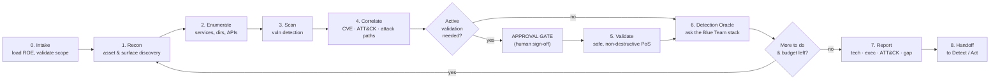
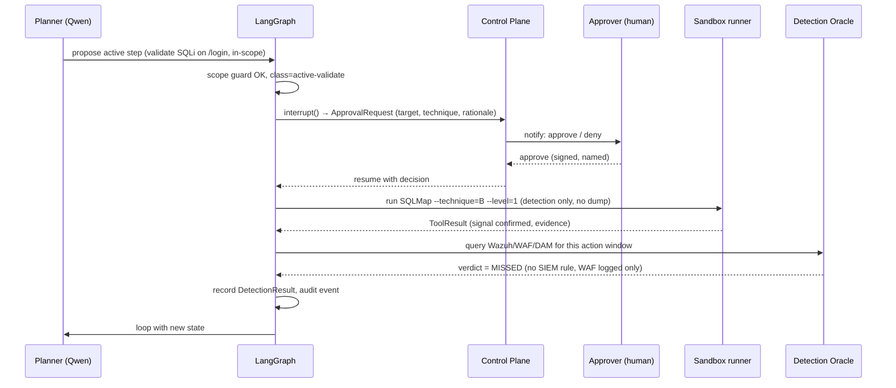

# RedBlueAI Safeguard — Operational Workflow

How an engagement actually runs, end to end: the red-team loop, the human-in-the-loop gates, and a worked black-box example.

---

## 1. The engagement lifecycle

The loop (Recon → … → Oracle → back to Plan) is driven by the LangGraph planner. The Oracle runs after **every** emulated action, not only at the end — that is what turns a scan into a control-validation exercise.

---

## 2. Phase-by-phase

### Phase 0 — Intake
Load the Rules of Engagement (`roe.yaml`): in-scope CIDRs/domains/cloud accounts, exclusions, time windows, named approvers, mode (black/gray/white-box), and the enabled profile (`non_destructive`). The scope guard validates every target *before* the graph starts. Nothing runs until scope is confirmed.

### Phase 1 — Recon (asset & surface discovery)
- Passive: DNS, WHOIS, certificate transparency (local/allowed sources), subdomain enumeration.
- Active-recon: `Nmap` (port/service), `httpx` (live hosts, tech), `WhatWeb` (fingerprint).
- Output: `Asset` records with technology fingerprints. → Oracle checks whether the recon itself was noticed (e.g. Wazuh port-scan detection).

### Phase 2 — Enumerate
- `Gobuster` (content/dir discovery), API endpoint enumeration, virtual-host discovery.
- Output: expanded surface (endpoints, hidden paths, APIs). → Oracle.

### Phase 3 — Scan (vulnerability detection)
- Web: `Nuclei` (safe template sets), `Nikto`.
- Cloud (gray-box): `Prowler`, `Trivy`.
- Source (white-box): `Semgrep` (SAST), `Gitleaks` (secrets), `Trivy` (deps/containers), `Checkov` (IaC).
- Output: normalised `Finding` records. → Oracle checks whether scanning tripped any detection.

### Phase 4 — Correlate
- Enrich each finding from the **local NVD mirror** (CVE detail), attach **EPSS/CVSS**, map to **MITRE ATT&CK** techniques.
- The attack-path correlator chains findings into candidate kill-chains.
- Risk scoring blends CVSS + EPSS + asset criticality + **prior detection status**.

### Phase 5 — Validate *(gated, active)*
Only reached when the planner decides a finding needs confirmation and the profile permits it. **Always behind the approval gate.**
- Non-destructive proof-of-signal only: reflected-XSS confirmation (`Dalfox`), boolean/time-based SQLi *detection* (`SQLMap`, no data dump), curated ATT&CK technique execution to test a specific detection.
- No data modification, no exfiltration, no DoS, no persistence — enforced by profile, not by prompt.
- Output: `Validation` records (confirmed / inconclusive) with evidence.

### Phase 6 — Detection Oracle
For the action(s) just performed, query the Blue Team stack over the action's time window and target:
- **Wazuh/SIEM**: did a rule fire? severity? time-to-detect?
- **WAF**: blocked/logged? which CRS rule?
- **EDR**: process/behaviour flagged or contained?
- **PAM (Nandi)**: privileged access logged/challenged?
- **DAM (Jatayoo)**: DB access recorded/anomaly-flagged?

Verdict per action: `DETECTED` / `PARTIAL` / `MISSED` / `BLOCKED`, plus MTTD. This is written to `detections[]` and is the core deliverable.

### Phase 7 — Report
- **Technical report**: findings, evidence, severity, reproduction.
- **Executive summary**: posture, top risks, detection coverage %.
- **ATT&CK coverage heatmap**: technique × detected/missed.
- **Detection-gap report**: every `MISSED`/`PARTIAL`, with the expected-but-absent detection — the actionable artifact.

### Phase 8 — Handoff
The gap report and validated findings flow to the **Detect** loop (new/updated correlation rules for the missed techniques) and **Act** loop (candidate response playbooks). This is the purple-team feedback that improves the platform over time.

---

## 3. Human-in-the-loop gate (how it works)

Key properties:
- The model **cannot** run the active step itself; it only produces a proposal.
- The graph **parks** at `interrupt()` and survives restarts (checkpointed) until a *named* human approves.
- Denial or timeout returns control to the planner, which continues without that step.
- Every hop is written to the append-only audit log.

---

## 4. Worked example — black-box engagement

**Scope (ROE):** `https://demo-app.esds-lab.internal` only; window 02:00–04:00 IST; mode black-box; profile non-destructive; approver = `void`.

1. **Intake** — scope guard confirms the single in-scope host; graph starts.
2. **Recon** — Nmap finds `443/tcp` (nginx), `8080/tcp` (Tomcat); httpx confirms live; WhatWeb fingerprints an old Tomcat. → *Oracle:* Wazuh fired a port-scan rule → `DETECTED` (MTTD 40s). Good — recon detection works.
3. **Enumerate** — Gobuster finds `/manager/html`, `/api/v1/users`. → *Oracle:* nothing fired → `MISSED`. Gap #1: content discovery invisible to SIEM.
4. **Scan** — Nuclei flags exposed Tomcat manager + a reflected parameter on `/search`; Nikto notes a missing security header. → *Oracle:* WAF logged the Nuclei bursts but did not block → `PARTIAL`.
5. **Correlate** — NVD mirror attaches CVEs to the Tomcat version; ATT&CK maps to `T1190` and `T1046`; attack-path correlator proposes *exposed manager → deploy → RCE* (flagged, not executed).
6. **Approval gate** — planner proposes confirming the reflected parameter (Dalfox) and a *detection-only* SQLi check on `/api/v1/users`. Approver `void` approves the XSS reflection check, **denies** the SQLi check for this window.
7. **Validate** — Dalfox confirms reflected XSS (non-destructive; benign marker payload). → *Oracle:* WAF did not block, no SIEM rule → `MISSED`. Gap #2.
8. **Report** — coverage: recon detected, content-discovery + XSS missed, scanning partial. Gap report lists the two `MISSED` items with the expected detections (a SIEM rule for `/manager/html` access; a WAF/CRS rule + SIEM alert for reflected-XSS patterns).
9. **Handoff** — gaps → Detect (author the two rules) and Act (candidate WAF rule for the XSS pattern).

The value delivered is **not** "the app has XSS" — it's "**the app has XSS *and your WAF and SIEM both missed it*, here's the rule to add.**"

---

## 5. Continuous mode

For always-on validation, engagements are scheduled per asset group. Each run compares against the previous baseline and reports **regressions** (a technique that was `DETECTED` last week is now `MISSED`) and **new gaps**. This turns Safeguard from a point-in-time assessment into a continuous control-assurance signal for the SOC — the same "always-on" posture Strix offers, but measured against *your defenders* rather than just your code.
