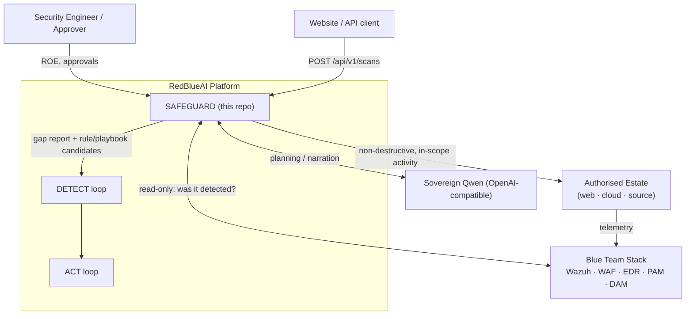
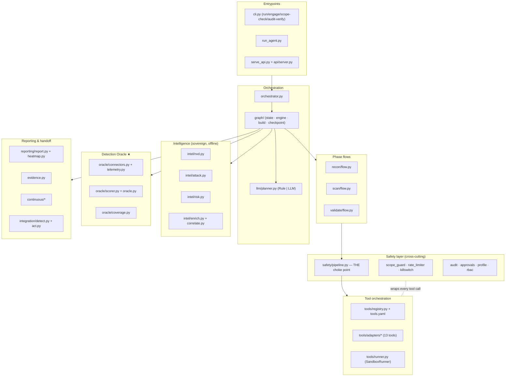
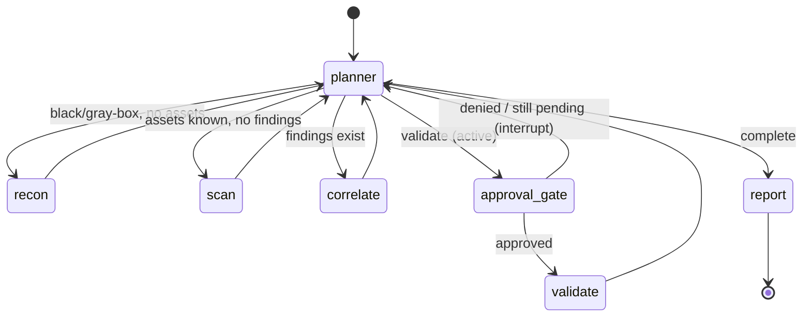
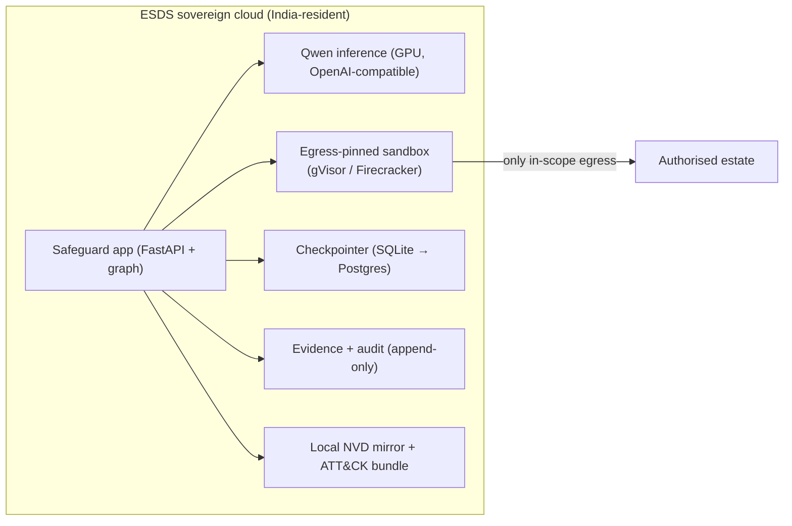

# RedBlueAI Safeguard (RedAgent) — HLD & LLD

**Scope of this document.** A ground-up High-Level Design (HLD) and Low-Level
Design (LLD) reconstructed from the actual code in `safeguard/`, the entrypoints
(`run_agent.py`, `run_llm.py`, `run_attack.py`, `serve_api.py`), the config
contracts (`roe*.yaml`, `tools.yaml`, `settings.example.yaml`), and the design
docs (`ARCHITECTURE.md`, `IMPLEMENTATION.md`, `ROADMAP.md`, `SAFETY.md`,
`WORKFLOW.md`). It closes with a prioritised list of possible future updates.

> One-line: Safeguard is a **safety-gated, non-destructive adversary-emulation
> agent** whose product is not "is this vulnerable?" but **"did the Blue Team
> stack detect it?"** — the Detection Oracle is the differentiator.

---

# PART A — HIGH-LEVEL DESIGN (HLD)

## A1. Purpose & problem statement

Safeguard is the **Red-team / purple-team loop** of the RedBlueAI platform. It
deliberately generates *authorised, in-scope, non-destructive* attacker activity
against ESDS's own estate and then asks the defensive stack (SIEM/WAF/EDR/PAM/
DAM) whether it noticed — producing a **detection-coverage matrix** and a
**detection-gap report** that feed the Detect and Act loops.

Three cooperating loops (this repo = Safeguard only):

| Loop | Role | Relationship |
|------|------|--------------|
| **Safeguard** | emulate TTPs against our estate to test controls | **this repo** |
| **Detect** | correlate live telemetry into incidents | consumer of gaps |
| **Act** | automated/approved response | consumer of gaps |

## A2. Design principles (non-negotiable, enforced in code)

1. **Control validation over vuln discovery** — the Oracle is first-class.
2. **Non-destructive by default** — only the `non_destructive` profile is
   loadable; the `destructive` safety class cannot even be represented in the
   `SafetyClass` enum.
3. **Fail-closed** — scope/window/approval default to *deny*; any ambiguity halts.
4. **LLM proposes, code disposes** — the model only returns a `PlanDecision`;
   execution happens *only* inside `SafetyPipeline.execute()`.
5. **Ground every number** — CVEs pass a numeric-claim verifier before entering a
   report.
6. **Sovereign & offline-capable** — local NVD mirror, local ATT&CK keyword map,
   sovereign Qwen inference; no foreign API in the default build.
7. **Everything auditable & resumable** — SHA-256 hash-chained audit log +
   checkpointed state.

## A3. System context



## A4. Component map (HLD → actual packages)



## A5. Runtime engagement lifecycle (the loop)



Key properties:
- The **planner is re-entered after every phase**; it inspects accumulated
  state (inventory, ledger, history, budget) and picks the next step.
- **Passive phases** (recon/scan) flow straight through the safety pipeline.
- Any **active step** is preceded by `approval_gate`, which raises a
  `GraphInterrupt` and *parks* the run until a named approver resolves it.
- After **every** emulated action, the **Detection Oracle** is queried (`_observe`)
  and the verdict is recorded — this is what makes it purple-team, not red-team.

## A6. Operating modes

| Mode | Input | Recon | Scan tools | Scope keys |
|------|-------|-------|-----------|-----------|
| `black_box` | URL / `host[:port]` | nmap→httpx→whatweb | nuclei, nikto | domains, cidrs |
| `gray_box` | cloud account IDs | (skips net recon on cloud) | prowler, trivy | cloud_accounts |
| `white_box` | local source paths | **no recon** | semgrep, gitleaks, checkov, trivy | repos |

## A7. External interfaces

- **CLI** (`safeguard`): `run`, `engage`, `scope-check`, `audit-verify`.
- **HTTP API** (Starlette, `api/server.py`): `POST /api/v1/scans` (async job),
  `GET /api/v1/scans/{id}`, `.../report`, `GET /api/v1/modes`, `GET /health`.
- **LLM**: OpenAI-compatible `POST {base}/v1/chat/completions` over stdlib
  `urllib` (no vendor SDK), env-driven key.
- **Tools**: 13 open-source binaries invoked as subprocesses via adapters.
- **Oracle**: read-only `TelemetryBackend.query()` contract (in-memory in dev;
  real Wazuh/WAF/EDR/PAM/DAM in prod).
- **Detect/Act handoff**: JSON files written to `runs/<id>/handoff/`.

## A8. Deployment view (target / sovereign)



**Current vs target** (from `IMPLEMENTATION.md`, each behind an existing interface):

| Concern | Dev (in-repo) | Production target | Interface seam |
|---|---|---|---|
| Graph engine | custom `StateGraph` | LangGraph + Postgres checkpointer | `graph/engine.py`, `Checkpointer` |
| Sandbox | `LocalSubprocessRunner` | gVisor/Firecracker egress-pinned | `SandboxRunner` |
| Telemetry | `InMemoryTelemetryBackend` | live read-only SIEM/WAF/EDR/PAM/DAM | `TelemetryBackend` |
| Planner | `RulePlanner` | `LLMPlanner` on Qwen | `Planner` (set `SAFEGUARD_LLM_BASE_URL`) |
| Control plane | `ControlPlane` core | FastAPI app | `api/control_plane.py` |

## A9. Technology stack

- **Language**: Python ≥3.10 (dataclasses, `from __future__ import annotations`).
- **Runtime deps** (deliberately minimal): `pyyaml`, `tzdata`; HTTP API adds
  `starlette` + `uvicorn`. No LangChain/LangGraph, no OpenAI SDK, no requests —
  stdlib `urllib`. Keeps the safety core dependency-light and sovereign.
- **Storage**: SQLite (`checkpoints.db`), JSONL (audit, handoff), content-addressed
  files (evidence), JSON (reports, baselines).
- **Tests**: `pytest` (~96 tests across `tests/test_*.py`).

## A10. Non-functional characteristics

- **Security**: 4-layer destructive-action defence (class-not-loadable →
  `forbidden_flags` → adapter mode ceilings → global `ProfileGuard`); fail-closed
  scope/window/approval; hash-chained audit; RBAC on control-plane actions.
- **Auditability**: every proposal/exec/result/denial hash-chained; `verify()`
  is tamper-evident; `audit-verify` re-checks the on-disk chain.
- **Resumability**: full state checkpointed per node; runs replayable.
- **Determinism/testability**: injected clocks (`now_fn`, `monotonic_fn`); rule
  planner + in-memory backends make runs reproducible offline.
- **Sovereignty**: zero foreign API in default build (structural, not a toggle).

---

# PART B — LOW-LEVEL DESIGN (LLD)

## B0. Repository layout

```
redAgent/
├── run_agent.py / run_llm.py / run_attack.py / serve_api.py   # entrypoints
├── roe*.yaml · tools.yaml · settings.example.yaml             # config contracts
├── safeguard/
│   ├── config/      models.py · loader.py
│   ├── safety/      pipeline.py · scope_guard.py · rate_limiter.py ·
│   │                killswitch.py · audit.py · approvals.py · profile.py ·
│   │                rbac.py · exceptions.py
│   ├── tools/       schema.py · adapter.py · runner.py · registry.py ·
│   │                adapters/{nmap,httpx,whatweb,gobuster,nuclei,nikto,
│   │                          trivy,prowler,semgrep,gitleaks,checkov,
│   │                          dalfox,sqlmap}.py
│   ├── recon/       assets.py · flow.py
│   ├── scan/        findings.py · flow.py
│   ├── validate/    flow.py
│   ├── graph/       state.py · engine.py · build.py · checkpoint.py
│   ├── llm/         client.py · planner.py · verifier.py
│   ├── intel/       nvd.py · attack.py · risk.py · enrich.py · correlate.py
│   ├── oracle/      models.py · telemetry.py · connectors.py · scorer.py ·
│   │                oracle.py · coverage.py
│   ├── reporting/   report.py · heatmap.py
│   ├── continuous/  baseline.py · runner.py
│   ├── integration/ detect.py · act.py
│   ├── observability/ metrics.py
│   ├── api/         service.py · server.py · control_plane.py
│   ├── orchestrator.py · engagement.py · evidence.py · cli.py
├── config/intel/    nvd.sample.json · attack_map.yaml
├── docs/            ARCHITECTURE · WORKFLOW · ROADMAP · SAFETY · this file
└── runs*/           per-engagement output (audit, evidence, report, handoff)
```

## B1. Configuration (`safeguard/config/`)

**`models.py`** — typed, frozen dataclasses; validation is explicit & fail-closed.

- `Mode` enum: `black_box | gray_box | white_box`.
- `SafetyClass` enum: `passive | active-recon | active-validate`. **`destructive`
  is intentionally not a member** — an un-representable state. `requires_approval`
  is `True` only for `active-validate`.
- `ALLOWED_PROFILES = {"non_destructive"}`; `_LOADABLE_CLASSES` derived from the
  enum so any other class string in `tools.yaml` is rejected at load.
- `TimeWindow(days, start, end)` with `_parse_hhmm` validation.
- `ScopeSpec(domains, cidrs, cloud_accounts, repos)` — `networks()` builds
  `ip_network` objects.
- `Exclusions(hosts, paths)`.
- `Budget(max_requests_per_second_per_target=10.0, max_concurrency_per_target=4,
  max_total_actions=500)`.
- `RulesOfEngagement` — `__post_init__` raises if no `authorisation_ref`, profile
  not allowed, or no approvers (fail-closed).
- `ToolSpec(name, safety_class, sandbox, default_flags, forbidden_flags, backend,
  template_policy, mode, extra)`.
- `Settings(llm_model, llm_base_url, llm_api_key_env, correlation_window_seconds,
  sandbox_runtime, ...)`.

**`loader.py`** — `load_roe/load_tools/load_settings`; `${VAR}` env expansion;
**fail-closed load** (a `destructive` class in `tools.yaml` raises at import time).

## B2. Safety layer (`safeguard/safety/`) — the heart of the system

### B2.1 `pipeline.py` — the single choke point

`SafetyPipeline.execute(adapter, ActionRequest) → ActionOutcome`. Ordered gates
(each failure raises a `SafetyViolation` subclass, is audited, and returns
`allowed=False` — no tool runs):

```
1. tool.proposed  (audit)
2. kill switch engaged?            → KillSwitchEngaged
3. scope.check_target(target)      → OutOfScope
4. scope.check_window(now)         → OutOfWindow
5. class requires_approval & not approved → ApprovalRequired
6. adapter.build_command + adapter.validate  (forbidden-flag guard)
6b. profile.check(command)         → global destructive-token deny
7. rate.acquire(target, monotonic) → RateLimited / BudgetExceeded
── all gates passed ──
8. runner.run(command, image, timeout)   (sandbox)
9. adapter.parse(inv, cmd_result) → ToolResult
10. evidence.put(stdout) → content-addressed ref stamped onto validations
11. tool.result (audit)   finally: rate.release(target)
```

Notable: kill switch is wired to `runner.revoke` at construction; clocks are
injected (`now_fn`, `monotonic_fn`); sandbox/parse errors are caught and returned
as an `ERROR` ToolResult (still `allowed=True`) rather than crashing the graph.

### B2.2 `scope_guard.py`

- `Target(raw, ip?, path?)`; `check_target` decomposes URLs into `(host, path)`,
  **exclusions win unconditionally**, then `_in_scope` matches: repos/cloud
  accounts literally; single IPs against CIDRs; **CIDR targets only if a subset**
  of an allowed network (`subnet_of`); domains by exact or parent-suffix match.
- `check_window(now)`: fail-closed if no windows; matches weekday + `[start,end)`
  minute range in the ROE timezone.
- `is_approver(name)`.

### B2.3 `rate_limiter.py`

Per-target **token bucket** (`rate = rps`) + **concurrency ceiling** + **global
`max_total_actions`**. `acquire` refills by elapsed×rate, denies without mutating
state; `release` decrements in-flight. Thread-safe (`Lock`), deterministic clock.

### B2.4 `audit.py`

`AuditEvent(seq, ts, actor, action, engagement_id, params_hash, detail,
prev_hash, hash)`. `compute_hash` = SHA-256 over a canonical JSON payload incl.
`prev_hash` → **hash chain**. `AuditLog.append` is thread-safe and flushes JSONL
to disk. `verify()` recomputes the chain end-to-end (tamper-evident). Genesis =
64 zeros.

### B2.5 `approvals.py`

`ApprovalStore` — HITL store for `active-validate`. `create()` → `ApprovalRequest`
(`pending`); `resolve(id, decision, approver)`; `is_approved(id)`. This is the
seam the graph's `approval_gate` interrupt binds to.

### B2.6 `profile.py`, `killswitch.py`, `rbac.py`, `exceptions.py`

- `ProfileGuard(profile)` — global denylist of destructive tokens applied to
  **every** command; only `non_destructive` enables execution (4th defence layer).
- `KillSwitch` — one `engage()` sets a flag + fires registered revocation hooks.
- `RBAC` — roles `admin/operator/approver/viewer` × actions `start/approve/kill/
  query`; `require()` raises `AccessDenied`.
- `exceptions.py` — `SafetyViolation` base + `OutOfScope/OutOfWindow/ApprovalRequired/
  RateLimited/BudgetExceeded/KillSwitchEngaged`.

## B3. Tool orchestration (`safeguard/tools/`)

**`schema.py`** — unified data model:
- `Severity`, `AssetType(host/service/endpoint/repo/cloud-account)`,
  `ToolStatus(ok/no-results/error/blocked)`.
- `Asset` — deterministic id from `(type,address,port,protocol)`; `merge_key()`.
- `Finding` — id from `(source_tool,asset_ref,title)`; `dedup_key = (asset_ref,
  title.lower)`; carries cve_ids, cvss, epss, attack_techniques, evidence_refs.
- `Validation(target, method, result, tool, approved_by, evidence_ref,
  non_destructive=True)`; `ValidationResult(confirmed/inconclusive)`.
- `ToolResult(tool, status, target, assets, findings, validations,
  raw_output_ref, ...)`.

**`adapter.py`** — `ToolAdapter` ABC: `build_command(inv) → validate(cmd) →
parse(inv, cmd_result)`. **Adapters cannot execute** — only the pipeline runs
them. `ToolInvocation(target, params, approval_id?)`.

**`runner.py`** — `SandboxRunner` ABC (`run`, `revoke`); `LocalSubprocessRunner`
(dev) checks `_revoked`, `shutil.which`, `subprocess.run` with timeout,
normalises bytes→str on timeout, `dry_run` short-circuits.

**`registry.py`** — binds `tools.yaml` specs to adapter classes (`ADAPTERS`
map); safety class is a property of the binding (not LLM-assertable). `runnable()`
= tools with an adapter; `declared()` = all specs.

**`adapters/*` (13)** — each normalises heterogeneous output into `Asset`/
`Finding`/`Validation` and enforces per-tool ceilings:
- Recon: `nmap` (XML→assets, timing ceiling), `httpx` (JSONL→endpoints),
  `whatweb` (aggression 3/4 blocked), `gobuster` (needs wordlist).
- Scan: `nuclei` (**safe-only** `-etags`; blocks re-enabling dos/intrusive),
  `nikto`, `trivy`, `prowler` (mutating flags rejected), `semgrep`, `gitleaks`
  (**secret value never stored** — DPDP), `checkov`.
- Validate (approval-gated): `dalfox` (reflection-only marker; blind/OOB rejected),
  `sqlmap` (`--technique=BT`, low level/risk, `--batch`; `--dump/--os-shell/
  --os-cmd/--file-write/--sql-shell` forbidden in both `tools.yaml` and adapter).

## B4. Phase flows (`recon/`, `scan/`, `validate/`)

- **`recon/assets.py`** — `AssetInventory`: dedup/merge on `(type,address,port,
  protocol)`; deep-merges tech fingerprints; `by_type`, `hosts()`.
- **`recon/flow.py`** — `ReconFlow.run(targets, plan, params)`: default plan
  `nmap→httpx→whatweb`; each step through the pipeline; denials/errors recorded,
  never fatal; returns steps + merged inventory + allowed/denied counts.
- **`scan/findings.py`** — `FindingLedger`: cross-tool dedup on `(asset_ref,
  title)`; keeps highest severity, unions CVEs/evidence/techniques, records
  contributing tools in `raw['sources']`; `by_severity()`.
- **`scan/flow.py`** — `ScanFlow.run(targets, plan)`: default `nuclei→nikto`;
  merges into one ledger.
- **`validate/flow.py`** — `ValidateFlow.run(tool, target, approval_id,
  technique, rationale)`: runs one approved active-validate tool through the
  pipeline; normalises `Validation` outcomes with the approver stamped on.

## B5. Orchestration graph (`safeguard/graph/`)

**`state.py`** — `PlanDecision(action, tool, target, technique, rationale,
requires_approval, params)` and `AgentState`:
- identity/mode/profile/targets; `phase`, `actions_spent`, `max_actions`;
- accumulators `inventory: AssetInventory`, `ledger: FindingLedger`;
- `plan_history`, `last_decision`, `pending_approval`, `validations`,
  `attack_paths`, `grounded_tokens`, `detections`, `detection_status`;
- `to_checkpoint()/from_checkpoint()` fully (de)serialise to plain dicts.

**`engine.py`** — a **LangGraph-shaped** in-repo `StateGraph`: `add_node`,
`add_edge`, `add_conditional_edges`, `set_entry`, `compile(checkpointer)`,
`invoke(state, thread_id)`, `resume(thread_id)`, and `GraphInterrupt` for HITL.
Mirrors the real LangGraph API so the swap is mechanical.

**`checkpoint.py`** — `Checkpointer` ABC; `InMemoryCheckpointer` +
`SqliteCheckpointer` (stdlib), full per-node history for replay.

**`build.py`** — `build_engagement_graph(...)` wires the 7 nodes:
- `planner_node` → records `PlanDecision`, appends history, audits.
- `recon_node` → `ReconFlow`, merges assets, then `_observe(recon, T1046)`.
- `scan_node` → mode-aware plan/targets (`_scan_plan_and_targets`), merges
  findings, then `_observe(scan, T1595)` against the finding targets.
- `correlate_node` → `Enricher.enrich` (grounded tokens) + `AttackPathCorrelator.
  build`, threading detection status into risk.
- `approval_gate_node` → creates approval + raises `GraphInterrupt`; on resume,
  re-reads the store (still pending → re-interrupt; else records decision).
- `validate_node` → runs `ValidateFlow` (or records intent), then `_observe`.
- `report_node` → numeric verifier over CVEs, top risk, `CoverageMatrix.summary`,
  assembles `state.report`.
- Routing: `route_from_planner` maps action→node; `route_from_gate` →
  `validate` iff approved else back to `planner`.

## B6. LLM service (`safeguard/llm/`)

**`client.py`** — `LLMClient` over stdlib `urllib`. `NodeProfile(reasoning,
temperature, max_tokens)`; `PROFILES` per node (planner reasons; extract is
cheap). Qwen hybrid-thinking via top-level `chat_template_kwargs.enable_thinking`
(the `extra_body` form is silently ignored by vLLM). `configured` = has base_url;
raises `LLMError` when unconfigured (callers fall back to `RulePlanner`). Handles
empty content on `finish_reason=length`. 180s timeout for serverless cold starts.

**`planner.py`** — `Planner` ABC:
- `RulePlanner` (default) — deterministic `recon → scan → correlate → gated
  validate (one high/critical, dalfox) → report`; mode-aware (no net recon for
  white-box; no active web validate for white-box).
- `LLMPlanner` — asks Qwen for JSON, then **validates in code**: unknown action →
  `report`; validate proposal must resolve to a registered `ACTIVE_VALIDATE` tool
  or be downgraded to `report`. Anti-loop guard (don't repeat one-shot stages) and
  anti-premature-report guard (must recon+scan a live surface first). The model
  **can never widen its own authority**.

**`verifier.py`** — `NumericClaimVerifier.verify(text, grounded)` — currently
flags any `CVE-\d{4}-\d+` not in the grounded token set. Empty = ok.

## B7. Intelligence (`safeguard/intel/`) — sovereign, offline

- **`nvd.py`** — `LocalNVDMirror` reads `config/intel/nvd.sample.json`; **no
  nvd.nist.gov at runtime**.
- **`attack.py`** — `AttackMap` maps findings→ATT&CK via keyword rules in
  `config/intel/attack_map.yaml` (offline STIX stand-in); `tactic_rank()` orders
  kill-chain steps.
- **`risk.py`** — `RiskScorer`: CVSS + EPSS + asset criticality **+ detection
  status**; an undetected medium can outrank a detected high.
- **`enrich.py`** — `Enricher.enrich(findings, detection_status)` attaches CVE
  detail + ATT&CK + risk and returns the **grounded token set** (numbers come
  only from artifacts).
- **`correlate.py`** — `AttackPathCorrelator.build`: groups findings per asset
  root, orders steps by tactic rank then risk, annotates each with its detection
  verdict; overall risk = max step risk; paths sorted by risk.

## B8. Detection Oracle (`safeguard/oracle/`) ★

- **`models.py`** — `DetectionEvent`, `DetectionResult(action_ref, target,
  technique, verdict, source, rule_id, ttd_seconds)`, `Verdict(BLOCKED >
  DETECTED > PARTIAL > MISSED)` with best-first aggregation.
- **`telemetry.py`** — `TelemetryBackend.query(target, start, end, technique)`
  contract; `InMemoryTelemetryBackend` for dev/tests; real sources slot in behind
  the same contract.
- **`connectors.py`** — read-only `Wazuh/WAF/EDR/PAM/DAM` connectors
  (`read_only=True` by construction); WAF/EDR can return `BLOCKED`, others observe.
- **`scorer.py`** — `CoverageScorer.score`: best verdict across sources + **MTTD**
  (earliest detection relative to action time).
- **`oracle.py`** — `DetectionOracle.observe(action_ref, target, technique,
  action_time, window)`: builds `[t-5s, t+window]`, queries every connector,
  scores one verdict. `correlation_window_seconds` default 300.
- **`coverage.py`** — `CoverageMatrix`: coverage %, mean MTTD, per-technique
  matrix, and the **gap report** (every MISSED/PARTIAL with expected detection).

## B9. Reporting, evidence, continuous, integration

- **`evidence.py`** — `EvidenceStore.put(bytes/str)` → SHA-256 content-addressed
  file; stable `evidence_ref` referenced from findings/validations.
- **`reporting/report.py`** — `Reporter.build(state) → ReportBundle`: `report.json`
  + executive summary, technical report, ATT&CK heatmap, **detection-gap report**;
  emits a `detection_index` ({technique|host → verdict}) that regression diffing
  keys on. `ReportBundle.write(dir)` writes the bundle.
- **`reporting/heatmap.py`** — `AttackHeatmap`: technique × verdict + coverage %.
- **`continuous/baseline.py`** — `BaselineStore` (append-only per-engagement
  `baseline-NNNN.json`) + `diff_reports(baseline, current) → RegressionReport`:
  **regressions** (was DETECTED/BLOCKED, now MISSED/PARTIAL), improvements,
  new/resolved gaps & findings, coverage delta.
- **`continuous/runner.py`** — `ContinuousRunner.record()`: diff fresh bundle vs
  stored baseline, then save it as the new baseline.
- **`integration/detect.py`** — `DetectIntegration`: each gap → `RuleCandidate`
  (technique, target, expected detection, wazuh|waf source, priority); writes
  `detect_rule_candidates.json` outbox.
- **`integration/act.py`** — `ActIntegration`: response **playbooks** + Jira-style
  **ticket** stubs → `act_playbooks.json` / `act_tickets.json`.
- **`observability/metrics.py`** — dependency-free counters/gauges with labels;
  export to Prometheus/OTel in deployment.

## B10. API & control plane (`safeguard/api/`)

- **`service.py`** — framework-agnostic core. `MODE_SPECS` (self-describing
  contract served at `/api/v1/modes`); `ScanRequest` + `.validate()` (fail-closed
  per mode); `configure_llm_env()` (loads `.env`, normalises base_url to `/v1`);
  `run_engagement(req)` — synthesises a per-request non-destructive ROE, builds an
  `Engagement`, chooses planner (LLM→rule fallback with an explicit reason),
  drives the graph, **auto-signs-off** parked validate steps (bounded by
  `max_approvals`), writes report + handoff, returns `EngagementResult`. Preflight
  `_unavailable_tools` explains a zero-finding scan caused by a missing binary.
- **`server.py`** — Starlette app; async job registry (in-memory, `ThreadPoolExecutor`
  max 2); routes for scans/report/modes/health; CORS defaults to any loopback
  origin (override with `SAFEGUARD_API_CORS_ORIGINS`). `configure_llm_env()` runs
  at import so the LLM is reached identically under uvicorn/gunicorn/tests.
- **`control_plane.py`** — `ControlPlane`: RBAC-gated, audited façade over the
  orchestrator (start/approve/kill/audit-query). *(Note: not yet exposed by the
  HTTP `server.py`, which is the website-scan surface — see future work.)*

## B11. Assembly & entrypoints

- **`engagement.py`** — `Engagement.build(...)` wires ROE + registry + the full
  `SafetyPipeline` (scope, rate, kill, audit, runner, approvals, profile, evidence,
  clocks) into one object.
- **`orchestrator.py`** — `Orchestrator.build(engagement, planner, checkpointer,
  oracle, plans...)` constructs recon/scan/validate flows + the compiled graph;
  `run/approve/resume`. `approve()` enforces the approver is a **named ROE
  approver** before resolving.
- **Entrypoints**: `cli.py` (`safeguard` console script), `run_agent.py`
  (planner-driven agent run), `run_llm.py` (LLM smoke), `run_attack.py`,
  `serve_api.py` (uvicorn launcher).

## B12. Key sequences

**Safe active validation (HITL):**
```
planner → PlanDecision(validate, dalfox, target, requires_approval)
 → approval_gate: create ApprovalRequest, raise GraphInterrupt  (run PARKS)
 → [Control Plane] named approver resolves → orchestrator.approve() (RBAC + named check)
 → resume: gate re-reads store → approved → validate_node
 → ValidateFlow → SafetyPipeline.execute (all gates) → sandbox → evidence
 → _observe → DetectionOracle verdict → planner loop
```

**Every-action Oracle observe:** after recon/scan/validate, `_observe` records a
`DetectionResult` per target and updates `detection_status[root(target)]`, which
`correlate_node` feeds into risk (undetected outranks detected).

## B13. On-disk run layout

```
runs-*/<engagement-id>/
├── audit.log.jsonl          # hash-chained events
├── checkpoints.db           # SQLite per-node state
├── roe.generated.yaml       # (API) synthesised authorisation
├── evidence/ev-<hash>.txt   # content-addressed raw output
├── baselines/baseline-*.json
├── report/{report.json, executive_summary.md, technical_report.md,
│            attack_heatmap.md, detection_gap_report.md}
└── handoff/{detect_rule_candidates.json, act_playbooks.json, act_tickets.json}
```

---

# PART C — POSSIBLE FUTURE UPDATES

Grouped by theme, with the rationale and the seam each change lands on. Items are
roughly ordered by production impact within each group. Items marked **[known]**
are already flagged in the repo's own docs.

## C1. Production cutover (swap dev backends for real ones) — **[known]**

| # | Change | Seam | Notes |
|---|--------|------|-------|
| 1 | Replace in-repo `StateGraph` with real **LangGraph** + **Postgres** checkpointer | `graph/engine.py`, `Checkpointer` | API already mirrored; mechanical swap |
| 2 | Replace `LocalSubprocessRunner` with **gVisor/Firecracker egress-pinned** runner (firewall bound to ROE allowlist) | `SandboxRunner` | The `LocalSubprocessRunner` is *not* egress-pinned — this is the biggest safety gap between dev and prod |
| 3 | Wire **live read-only** Wazuh/WAF/EDR/PAM/DAM backends | `TelemetryBackend.query` | Today only `InMemoryTelemetryBackend`; without it coverage is simulated |
| 4 | Enable `LLMPlanner` on sovereign **Qwen** in prod (set `SAFEGUARD_LLM_BASE_URL`) | `Planner` | Confirm production model (docs note Qwen3-32B vs 9B dev) |
| 5 | Real **NVD sync job** + fuller mirror (currently `nvd.sample.json`) | `intel/nvd.py` | Add a scheduled sovereign sync |
| 6 | Real **MITRE ATT&CK STIX** bundle instead of keyword `attack_map.yaml` | `intel/attack.py` | Improves technique mapping fidelity |

## C2. Safety & security hardening

- **Expose the kill switch & Control Plane over HTTP.** `control_plane.py` (RBAC +
  audit) is not wired into `api/server.py`; the website surface has no kill,
  approve, or audit-query endpoint. Unify the two API surfaces behind RBAC/auth.
- **Add authN/authZ to the HTTP API.** `server.py` has no API keys/tokens/auth —
  anyone who can reach the port can start scans. Add auth + per-operator identity
  feeding RBAC and the audit `actor`.
- **Reconsider API auto-approval of active-validate steps.** `run_engagement`
  auto-signs-off parked validate steps (`APPROVER="operator"`, bounded by
  `max_approvals`). This bypasses the HITL guarantee for API-driven runs; make it
  opt-in / policy-gated and record it distinctly in the audit trail.
- **Approval timeouts.** Docs describe "deny/**timeout** → skip", but
  `ApprovalStore` has no TTL — a parked run waits forever. Add a timeout that
  audits and routes back to the planner.
- **Secrets from a real store.** Move from `.env`/env vars to Nandi/Vault; never
  persist the LLM key in process env longer than needed.
- **Widen the numeric-claim verifier.** It currently checks **only CVE IDs**; the
  design promises CVSS/EPSS/counts/ports too. Extend `_NUMBER` handling and ground
  against the enriched artifact set.
- **Run Safeguard's own security review / SAST in CI** (it ships semgrep/gitleaks
  adapters — dogfood them on this repo).

## C3. Capability / coverage gaps

- **Subdomain enumeration** — **[known]** deferred; no subfinder/amass adapter.
  Two-step add (tools.yaml entry + adapter) that slots into `ReconFlow`.
- **Dedicated `enumerate` phase.** `WORKFLOW.md` describes an Enumerate step
  (gobuster/API/vhost), but the graph has no `enumerate` node — content discovery
  currently rides in recon. Add the node + planner routing to match the design.
- **Curated ATT&CK technique executors** (Atomic Red Team-style) for testing
  specific detections — named in the design, not yet an adapter/executor set.
- **k8s read-only checks** for gray-box (design mentions; only prowler/trivy today).
- **More validate-class tools** behind approval (e.g. safe SSRF/IDOR signal
  confirmation) folded into `ValidateFlow` with the same 4-layer defence.

## C4. Platform integration & operations

- **Real Detect/Act delivery.** `integration/*` writes JSON outboxes; production
  should POST to the Detect/Act APIs with retries/idempotency.
- **Continuous scheduling.** `ContinuousRunner` diffs vs baseline per manual run;
  add a scheduler (cron/celery) for always-on per-asset-group validation and
  trend dashboards.
- **Observability export.** `observability/metrics.py` is in-memory; export to
  Prometheus/OTel and add tracing across graph nodes and tool runs.
- **Job store durability.** API job registry is in-memory single-process
  (`_JOBS` dict, `ThreadPoolExecutor(2)`); move to Redis/DB so jobs survive
  restarts and scale horizontally. Also add pagination/listing endpoints.
- **Operator runbooks + load/soak testing** — **[known]** listed as remaining P10
  hardening.
- **Report formats** — add PDF/HTML export and a SARIF export for the
  white-box/SAST findings so results plug into existing dev tooling.

## C5. Developer experience & housekeeping

- **Sandbox build tooling.** README references `make sandbox-build` and a
  `sandbox/` dir with Dockerfiles that are not in the tree — add them (or the
  Makefile) so the documented quickstart works.
- **Package/entrypoint consistency.** `pyproject.toml` declares the `safeguard`
  console script; verify `run_agent.py`/`serve_api.py` are covered by
  `[project.scripts]` and pinned deps (starlette/uvicorn) are declared, not just
  assumed installed.
- **Remove the stray `-` file** (3-byte artifact at repo root, likely an
  accidental redirect) and add `runs*/` output dirs to `.gitignore` if not meant
  to be versioned.
- **Type checking + coverage gates in CI** (mypy/ruff) — the code is
  type-annotated and would benefit from enforcement.
- **Config unification.** Root has `roe.yaml`, `roe.demo.yaml`, `roe.example.yaml`,
  `roe.whitebox.yaml` and duplicated `tools.yaml`/`settings` at both root and the
  README's proposed `config/`; consolidate to one canonical location.

## C6. Intelligence & scoring improvements

- **EPSS feed** alongside the CVE mirror to make `RiskScorer` EPSS term live
  (today EPSS is a field that must be populated from artifacts).
- **Asset-criticality inputs** — let the ROE/scope declare per-asset criticality
  so risk scoring reflects business context, not just CVSS/EPSS.
- **Attack-path validation loop** — currently paths are *candidate hypotheses*;
  optionally let the (gated) validate phase confirm a hop and update the path's
  detection verdicts end-to-end.

---

## Appendix — quick reference

**Safety classes & gates**

| Class | Gate | Example tools |
|-------|------|---------------|
| `passive` | rate limit | cve_lookup, semgrep, gitleaks, checkov |
| `active-recon` | rate limit | nmap, httpx, whatweb, gobuster, nuclei, nikto, trivy, prowler |
| `active-validate` | **approval + rate limit** | dalfox, sqlmap |
| `destructive` | **not loadable / unreachable** | — |

**Four-layer destructive-action defence:** (1) class not representable in the
enum → (2) per-tool `forbidden_flags` → (3) per-adapter mode ceilings → (4) global
`ProfileGuard` token denylist on every command.

**Verdict precedence (Oracle):** `BLOCKED > DETECTED > PARTIAL > MISSED`.
